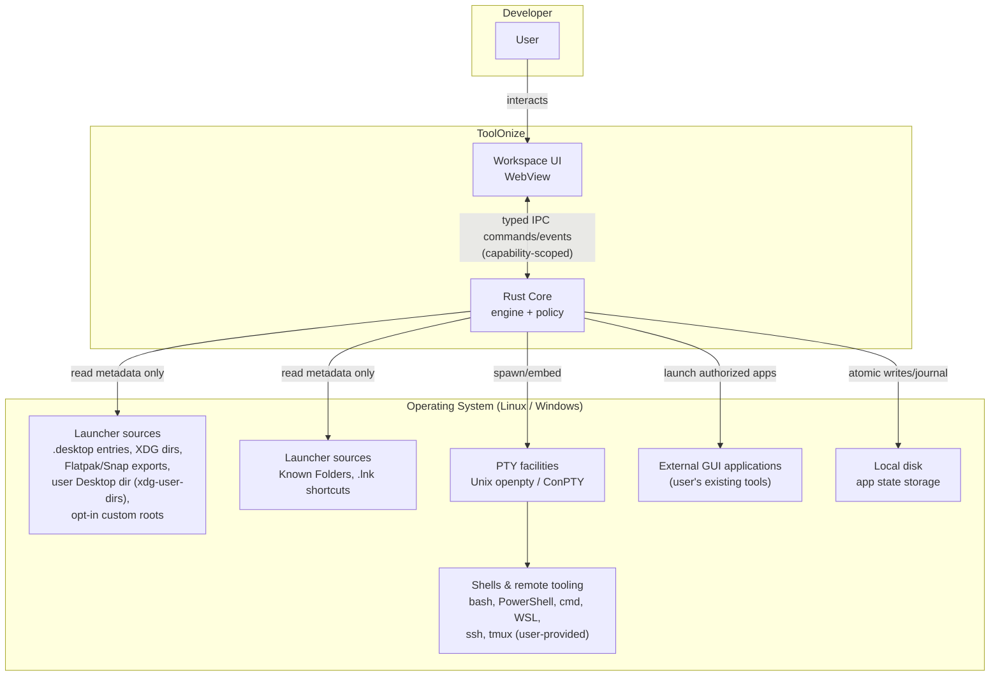
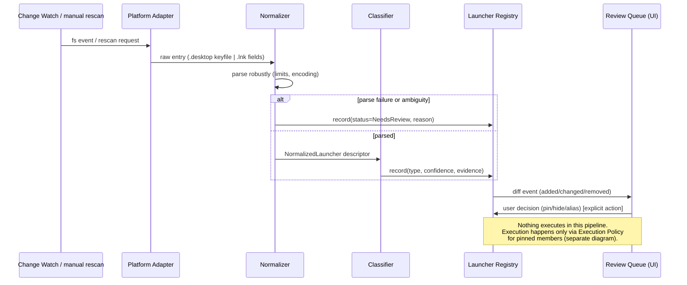
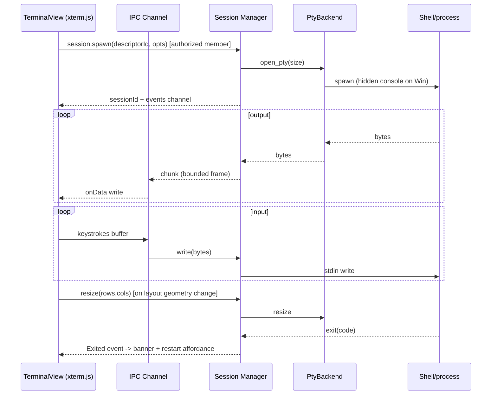

# Architecture

Status: DRAFT — pending human review. No code exists; diagrams are design
artifacts, not descriptions of built software.

Companion documents: DOMAIN_MODEL.md (entities), PLATFORM_ADAPTERS.md
(OS boundaries), THREAT_MODEL.md (security analysis), TECHNOLOGY_RESEARCH.md
(evidence for choices).

---

## 1. Architectural style

Single cross-platform desktop application:

- **Rust core** (Tauri 2 backend): owns all privileged capability — discovery,
  registry, classification, execution policy, PTY sessions, persistence.
- **React/TypeScript frontend**: workspace UI, docking layout, terminal
  rendering. Treated as untrusted by design.
- **Trust boundary**: the Tauri IPC bridge with a capabilities/permissions
  model; the frontend may only invoke explicitly whitelisted, scoped commands
  (ADR-001; v2.tauri.app/security).

## 2. Context diagram



Notes:
- Discovery touches launcher sources read-only; execution is a separate,
  authorized path.
- ssh/tmux are the *user's own* environment; we embed terminals that use
  them, we do not implement SSH or multiplexing.

## 3. Container/component diagram

```mermaid
graph TB
    subgraph Frontend["Frontend (WebView, untrusted)"]
        UI[Layout UI - flexlayout-react]
        TV[TerminalView - xterm.js]
        RQ[Review Queue UX]
        ST[UI State Store]
    end

    subgraph Boundary["Trust Boundary = Tauri IPC + Capabilities"]
        CMD["Command surface (whitelisted)<br/>discovery.query / registry.* /<br/>workspace.save / session.spawn ...<br/>each with explicit permission scope"]
    end

    subgraph Core["Rust Core (trusted)"]
        WE[Workspace Engine]
        LR[Launcher Registry]
        LC[Launcher Classification]
        SM[Terminal Session Manager]
        PERS[Persistence]
        SECX[Security / Execution Policy]
        EAL[External Application Launcher]
        PAA[Platform Adapter API trait]
        WATCH[Change Watch Service]

        subgraph Adapters["Platform Adapters"]
            LA[Linux Adapter]
            WA[Windows Adapter]
        end

        subgraph PtyLayer["PTY layer (ADR-004 spike decides impl)"]
            PB[PtyBackend trait]
            IMPL[Chosen backend(s)]
        end
    end

    UI --> ST
    TV --> ST
    RQ --> ST
    ST <--> CMD
    CMD --> WE
    CMD --> LR
    CMD --> SM
    CMD --> PERS
    WE --> LR
    WE --> PERS
    WE --> SECX
    SM --> PB
    SM --> SECX
    EAL --> SECX
    LC --> LR
    WATCH --> LR
    PAA -.implemented by.-> LA
    PAA -.implemented by.-> WA
    WATCH --> PAA
    LR --> PAA
    PB --> IMPL
```

Every frontend→core arrow crosses exactly one boundary (IPC command with
scope). There is deliberately no "generic exec" command — see THREAT_MODEL
T-WEB-01.

## 4. Component responsibilities

| Component | Owns | Must not |
| --- | --- | --- |
| Launcher Registry | normalized records, launcher_id + descriptor_fingerprint, user decisions (pin/hide/alias), diffing | execute anything; use ID mutation as a security mechanism |
| Launcher Classification | deterministic rules → type + confidence + reasons | mutate registry |
| Change Watch | fs events → rescan/diff triggers | touch sessions |
| Workspace Engine | workspaces, membership, startup policy orchestration | bypass policy |
| Terminal Session Manager | process session state machine, PTY handles, lossless output pump, restart/reconnect semantics | trust frontend sizes blindly; drop PTY bytes |
| Security/Execution Policy | argv construction, authorization checks bound to launcher_id+descriptor_fingerprint+scope, audit log | delegate decisions to frontend |
| External App Launcher | detached launch of authorized external targets | manage foreign windows |
| Persistence | atomic state files, journal, migrations, import/export validation | store secrets |
| Platform Adapter API | traits: LauncherSource, FsWatch, ShellResolver | contain business logic |
| Linux/Windows Adapter | concrete source enumeration + watchers per research docs | leak platform details upward |
| Layout UI | FlexLayout model, mode transforms, drag/dock — mutates view attachment/layout only | own session lifetime or mutate process state |
| TerminalView | xterm instance, addons, input/output wiring to session bus | spawn processes |

## 5. Launcher discovery pipeline



Design rules (from PLATFORM_DISCOVERY_RESEARCH): Linux Exec parsing follows
spec quoting/field-code rules — never shell interpretation; Windows `.lnk`
handling follows the M6-spike policy (stored metadata first where sufficient;
Resolve only when necessary with conservative flags) so discovery never
silently re-targets or mutates links.

## 6. Terminal PTY data flow



Lifecycle independence rules (mandatory; ADR-003 remains conditional until
the M4 lifecycle test passes):

1. **Process vs view separation.** The *session* lives in Rust keyed by
   sessionId and carries `process_state` (New/Starting/Running/Exited/Failed/
   Stopping/Closed; remote adds Disconnected/Reconnecting). The view carries
   a separate `view_state` (Detached/Attached/Hidden). Layout moves re-parent
   the DOM node and mutate only `view_state`; they never close, reset, or
   respawn a session (PRD FR-031).
2. **M4 must prove** — FlexLayout's upstream "preservation of component state
   when tabs are moved" claim is about React component state and is NOT by
   itself sufficient evidence for our xterm/session lifecycle:
   - xterm `Terminal` instance identity remains stable across drag, tabset
     move, maximize, restore, tab switch, and all four mode transformations;
   - PTY session id remains stable;
   - `dispose()` is never called on layout movement;
   - scrollback remains intact for ordinary layout changes;
   - resize propagation (rows/cols) remains correct through every transform;
   - Focus → Restore returns the exact running terminal (same instance,
     same session, same scrollback);
   - mode transformations do not respawn processes.
3. **Stable-host architecture.** If the FlexLayout spike cannot satisfy
   these obligations with direct mounting, evaluate a stable host/portal
   pattern: one long-lived terminal host per session; layout nodes act as
   attachment targets (React portal / persistent host permitted). Do NOT
   prematurely require the portal implementation if the spike proves it
   unnecessary.
4. Scrollback lives in the xterm buffer while its view exists; if a view is
   destroyed (member removed), scrollback up to the cap is retained
   server-side only if the member is kept in the workspace — otherwise
   discarded with the session closed explicitly.

Output delivery requirement: the output path is **lossless**. Terminal VT
streams are stateful — silently dropping arbitrary bytes can corrupt escape
sequences and renderer state. The pump uses bounded batching/coalescing with
high/low water marks and backpressure toward the PTY reader/child via normal
OS flow-control consequences; per-session isolation prevents one stream from
blocking others; exceeding a hard safety limit surfaces an explicit
desynchronization/error state — never silent byte loss (NFR-002). M2/M3
measurements determine practical chunk sizes and queue limits.

## 7. Layout ownership and modes

FlexLayout Model is owned by the frontend store; it is *projection*, not
truth. Truth = Workspace Engine membership list + saved layout JSON snapshot.
Mode transforms (Grid/Focus/Tabs/Master+Stack) are pure functions over the
layout JSON producing new valid models; sessions untouched. On save,
`model.toJson()` is validated against our schema then persisted via
workspace.save. Import treats external JSON as hostile (schema-limited,
size-capped).

## 8. Workspace persistence flow

Save: engine serializes {schemaVersion, workspaces[{members[], layoutJson,
policy, meta}], registryDecisions, settings} → validate → temp file → atomic
rename → fsync dir. Journal appends intent records before mutations to allow
replay after crash. Load: verify checksums/schema → apply journal replay →
migrate if needed → hand to engine; corrupt file ⇒ previous snapshot +
user-visible loss-window report (FS-03).

Session honesty: persisted state stores *membership and descriptors*, never
processes. On restore, terminal members start fresh unless policy says ask/
start; tmux-based members display reconnect affordance because their real
state lives in tmux, not here.

## 9. Process/session lifecycle states

Two orthogonal state machines (details and invariants: DOMAIN_MODEL §3):

- **ProcessSessionState** (PTY/child-process or remote attach):
  `New → Starting → Running → Exited(code) | Failed(reason)`, plus
  `Stopping → Closed` on close, a `Restarting` transition, and — remote
  members only — `Disconnected ↔ Reconnecting` (user-initiated). Plain SSH
  reconnect starts a NEW remote shell/process unless the invoked remote
  environment itself persists state; tmux/screen persistence belongs to the
  external multiplexer. The Rust-owned local PTY process can survive a
  renderer/WebView reload while the native application stays alive; whole-app
  exit terminates local children per policy; "detach expected" members are
  documented as externally persistent.
- **ViewAttachmentState** (`Detached | Attached | Hidden`): owned by the
  layout layer. Drag, tab switch, focus, grid, maximize, restore and any
  workspace layout transformation mutate ONLY this machine and layout JSON.

Underlying script changes never signal sessions (FR-038); they only update
registry descriptors used at next explicit start.

## 10. Failure containment

- One panicking adapter scan → that source marked degraded; others continue.
- Session pump isolation: a misbehaving PTY stream cannot block IPC of other
  sessions (per-session bounded queues; lossless delivery with batching,
  water marks, and backpressure — see §6 output requirement; a hard-limit
  breach surfaces an explicit desynchronization/error state, never silent
  byte loss).
- Renderer crash: Rust core persists nothing mid-command (commands are
  transactional), sessions keep running; reload reattaches by sessionId.
- Watch overflow (inotify queue / ReadDirectoryChangesW buffer) → full rescan
  fallback, UI badge.
- Persistence failure (disk full) → command returns error; journal intact.

## 11. Platform adapter boundaries

See PLATFORM_ADAPTERS.md for full contracts. Summary: adapters expose three
traits — `LauncherSource` (enumerate raw launchers), `FsWatch` (change
events), `ShellResolver` (default shells/WSL lists/terminal-emulator hints).
All platform quirks (XDG vs Known Folders; inotify vs ReadDirectoryChangesW;
hidden-console spawn flags) live below this line.

## 12. Configuration storage boundary

App writes only under: Linux `$XDG_CONFIG_HOME/<app>` + `$XDG_STATE_HOME/<app>`
(or documented fallbacks); Windows `%APPDATA%\<app>` resolved via Known
Folder APIs. Contents: settings.json, workspaces.json, journal/, and the
launcher registry state store (storage backend/format deliberately not yet
chosen — a future ADR decides; no format is implied by this name).
Never written: anything under the repository checkout at runtime; secrets
anywhere (SEC-004). Uninstall story = delete these dirs (documented).

## 13. Dependency decision states

Each dependency carries one status, tracked in TECHNOLOGY_RESEARCH +
ADRs:

| Status | Meaning |
| --- | --- |
| Decided | ADR Accepted (tauri/react/ts/xterm.js/flexlayout*) |
| Proposed+Spike | ADR-004 PTY backend |
| Candidate-fallback | dockview (if flexlayout gate fails in M4) |
| Under evaluation | packaged-app enumeration API (M6 spike) |
| Rejected-for-V1 | PATH-wide scanning default; any AI/cloud dependency |

*flexlayout acceptance is conditional on the M4 state-preservation proof —
the go/no-go criterion is written into IMPLEMENTATION_PLAN M4.

## 14. Deliberately absent abstractions (anti-overengineering)

No plugin API, no scripting engine, no abstraction over "future cloud sync",
no generic "task runner" concept, no custom widget toolkit, no ORM — each has
no V1 customer per PRD scope.
