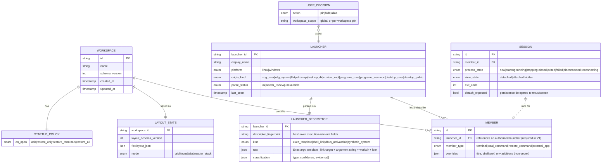

# Domain Model

Status: DRAFT — pending human review. Conceptual entities and invariants;
no code.

---

## 1. Entity overview



## 2. Definitions and invariants

### Launcher (registry record)
A discovered, normalized item. **Invariant:** a Launcher is inert data — it
can never self-execute; execution paths require an authorized Member.

- `launcher_id` (stable identity): identifies the *logical launcher* and
  remains stable across ordinary metadata/target edits where the platform
  identity is unchanged. Derivation per origin kind:
  - registered Linux application: desktop-file ID + source/precedence
    identity;
  - Linux Desktop-dir / custom-root entries: source-root identity + relative
    path (an explicitly documented stable source identity). Such entries are
    outside the XDG `applications/` registration system and therefore have no
    guaranteed Desktop File ID — this is modeled, not papered over;
  - Windows shortcut: source root + relative shortcut identity or another
    platform-validated identity.
  Changing primary IDs is never the security mechanism; see
  `descriptor_fingerprint`.
- `parse_status=needs_review` blocks execution structurally.

### LauncherDescriptor
Parsed metadata only: Linux `Exec` argv-template (+ field-code info,
TryExec, Path, Terminal flag) or Windows link tuple (target, command-line
argument string, workdir, icon). Carries `classification` with human-readable
evidence strings so the review queue can explain itself ("Terminal=true",
"target ends with wsl.exe", "explicit interpreter target").

- `descriptor_fingerprint`: a hash over the security-relevant executable
  metadata — as applicable: executable/target; argv/Exec template; working
  directory; relevant launch mode; source identity; other execution-relevant
  fields. It changes whenever any covered field changes.
- **Authorization binding invariant:** execution authorization is bound to
  `launcher_id + descriptor_fingerprint + workspace/member authorization
  scope`. When a security-relevant descriptor change is detected:
  - launcher membership remains visible and preserved;
  - running sessions remain untouched (never killed/restarted by discovery);
  - the member becomes `Changed / Re-review Required`;
  - prior execution authorization is invalid for the next start;
  - no silent execution using the changed descriptor (re-review required).

### Classification types (closed set)
`EmbeddedTerminalCandidate | LocalCommand | RemoteSsh | ExternalGuiApp |
Unknown`. **Invariant:** only the first four are executable after explicit
authorization; Unknown never reaches any execution path.

### Workspace
Named container binding Members + LayoutState + StartupPolicy.
**Invariants:**
- Membership references launchers by id; deleting a launcher marks members
  `orphaned` (visible, non-executable) rather than silently dropping them.
- Layout JSON must validate against our schema before load; invalid →
  fallback to default layout for that workspace, original preserved for
  inspection.

### Member
Workspace-scoped instantiation of a launcher. **V1 invariant:** every
executable member references either (a) an authorized launcher/descriptor in
the registry or (b) an explicitly defined trusted synthetic system launcher
produced by the native core. The frontend can never create an arbitrary
executable descriptor by passing raw command text; there is no generic exec
path (THREAT_MODEL T-WEB-01).

Synthetic system launchers (e.g., built-in default-shell choices such as
bash/PowerShell) are core-generated descriptors with explicit provenance and
fixed typed fields. They still pass through execution policy and review like
any launcher; they are not arbitrary frontend command strings.

User-typed ad-hoc/custom commands are **out of scope for V1** (PRD §3;
post-V1 Custom Command Editor consideration). Discovered Local Command
launchers remain core V1 functionality.

Overrides may add display title/shell preferences; overrides may NOT inject
arbitrary argv fragments beyond what the descriptor grammar allows.

### Session (runtime)
Process-backed or remote-attached terminal instance. **Invariants:**
- Exactly one live session per Member at a time.
- Session state changes emit events consumed by UI; UI cannot command state
  transitions except {start(authorized), restart, stop, reconnect}.
- **Two orthogonal state machines** (mandatory separation — the PoC showed
  lifecycle bugs from conflating view/layout ownership with process
  lifetime):
  - `process_state` — the PTY/child-process (or remote attach) lifecycle:
    `New → Starting → Running → Exited | Failed`, plus
    `Stopping → Closed` on close, and a `Restarting` transition. Remote
    command lifecycle may additionally expose `Disconnected ↔ Reconnecting`.
  - `view_state` — purely presentational attachment of the view to layout:
    `Detached | Attached | Hidden`. Layout operations (drag, tab switch,
    focus, grid, maximize, restore, any workspace layout transformation)
    affect ONLY `view_state` and layout JSON; they MUST NOT mutate
    `process_state`.
- Local process lifetime honesty: closing the app terminates local child
  processes unless `detach_expected` documents external multiplexer
  persistence (tmux/screen) — PRD FR-037. A Rust-owned local PTY process can
  survive a renderer/WebView reload while the native application process
  remains alive; if the whole application exits, its local processes
  (including local `ssh` children) normally exit. Plain SSH reconnect means a
  NEW remote shell/process unless the invoked remote environment itself
  persists state; tmux/screen persistence belongs to the external
  multiplexer, not to us.

### UserDecision
Pin (authorize into workspace scope), Hide (suppress from lists), Alias
(rename display). A Pin records the `descriptor_fingerprint` it authorized;
the *effects* of pinning are enforced in the Execution Policy against
`launcher_id + descriptor_fingerprint + workspace/member scope`, not in UI
state alone.

### StartupPolicy
Per-workspace enumerated policy (ask default). Executing it is a single
transactional routine in the Rust core that walks members in dependency-free
order; failures isolate per member (FS-02/FS-05).

## 3. State machines

Process session states (orthogonal from view attachment):

```
New ──start──> Starting ──spawned──> Running
                   │fail                 │exit(code)        │stop
                   ▼                     ▼                  ▼
                Failed ◄────────────  Exited            Stopping ──► Closed
Running ──restart──► Restarting ──► Starting (fresh process)
(remote) Running ──net drop──► Disconnected ──user reconnect──► Reconnecting
Reconnecting ──attached (new remote shell/process unless the invoked remote
environment itself persists state, e.g. tmux/screen)──► Running
```

View attachment states (layout-only; never touches the process lifecycle):

```
Detached ──attach──► Attached ⇄ Hidden (tab inactive/obscured)
Attached/Detached changed ONLY by layout operations (drag, tab switch,
focus, grid/maximize/restore, mode transforms).
```

Registry entry lifecycle: `Discovered → Classified(ok|needs_review|
unavailable) → (Pinned↔Unpinned | Hidden) → Changed(descriptor_fingerprint
change ⇒ re-review required; launcher_id and decisions preserved;
authorization suspended until re-reviewed) → Removed(tombstoned one
retention period)`.

## 4. Non-secret import/export shape

Export bundle = {schemaVersion, workspaces with portable member descriptors
(name + kind + portable invocation hint e.g. `"ssh alias:build-server"` or
`"app:Org.Example.Tool"`), layout, policy}. Machine-bound absolute paths are
omitted unless explicitly opted in; import lands everything in Needs Review
staging regardless (defense in depth).

## 5. Ownership map

| Data | Owner component |
| --- | --- |
| Launchers, decisions | Launcher Registry |
| Workspaces, membership, policies | Workspace Engine |
| Sessions, PTY handles | Terminal Session Manager |
| Layout JSON snapshots | Persistence (via Workspace Engine save) |
| Authorization checks | Security/Execution Policy |

UI stores are caches/projections only; every mutation flows through an IPC
command to the owning core component.
