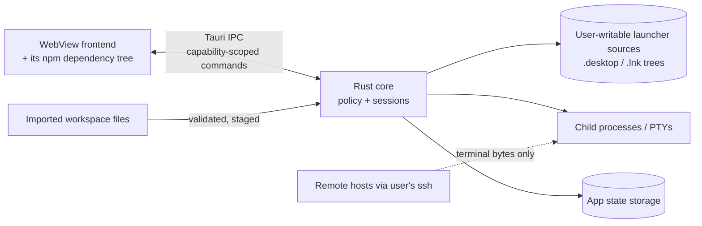

# Threat Model

Status: DRAFT — pending human review. Structured as
Assets → Trust Boundaries → Threats (STRIDE-informed) → Mitigations →
Explicit non-goals. IDs are stable for traceability from PRD SEC-* and tests.

Context: local-first desktop app; the *user's own machine* is the primary
environment. We assume a hostile-capable input surface: launcher metadata is
attacker-influenced whenever it can be written by anything other than the OS
package system (e.g., extracted archives, cloned repos with .desktop files,
network drives, shared "workspace export" files).

---

## 1. Assets

| ID | Asset | Notes |
| --- | --- | --- |
| A1 | User's execution authority | anything that can spawn processes as the user |
| A2 | Launcher Registry integrity | decisions/pins must not be forged |
| A3 | Workspace state integrity/correctness | layouts, memberships |
| A4 | Terminal I/O confidentiality/integrity | scrollback, keystrokes incl. secrets typed into shells |
| A5 | SSH credential boundary | we never see keys; agent/config remain user-owned |
| A6 | Clipboard contents | may contain anything sensitive |
| A7 | Repository public-safety | repo must never contain personal/secret data |
| A8 | Update/supply-chain integrity | artifacts + dependencies |

## 2. Trust boundaries

- **B1**: WebView ↔ Rust core (IPC). Frontend treated as potentially
  compromised (XSS in chrome, malicious npm dep).
- **B2**: Filesystem launcher sources ↔ discovery parser.
- **B3**: Child processes ↔ app (PTY byte stream).
- **B4**: Imported config ↔ state store.
- **B5**: Repository ↔ public internet (release-time boundary).

## 3. Threat catalog & mitigations

### Discovery / parsing

- **T-DISC-01 Malicious discovered launcher** (attacker plants
  `Evil.Tool.desktop` or Start Menu `.lnk`).
  - Impact if unmitigated: misleading entries; possible user-initiated
    execution of attacker code.
  - Mitigations: discovery never executes (SEC-001); classification marks
    unknown origins Needs Review; review UI shows origin path + full parsed
    fields; execution requires explicit pin (FR-013). Residual: user approves
    a convincing fake — mitigated by origin labeling (system vs user vs
    flatpak) and change-detection re-review on target change.
- **T-DISC-02 Unsafe Desktop Entry parsing** (huge files, deep nesting,
    invalid UTF-8, hostile quoting/field codes).
  - Mitigations: bounded reads; robust parser fuzzed (TEST §2); spec-exact
    tokenizer — no shell interpretation ever; malformed ⇒ needs_review,
    never panic (FS table); property tests for quoting round-trip.
- **T-DISC-03 Argument/command injection via Exec/link arguments** (strings
    like `foo; rm -rf ~` or `& whoami`).
  - Platform facts: Linux Desktop Entry `Exec` is an argv-template grammar
    defined by the Freedesktop specification; our launch path does not invoke
    a shell to interpret it, so shell metacharacters remain ordinary argument
    data unless the executable itself is a shell. A Windows Shell Link
    (`.lnk`) stores a target executable/path, a command-line argument
    *string*, a working directory, and other link metadata — it is not a
    pre-parsed argv array. How the target receives/processes command-line
    text follows the target application's/runtime's own semantics; ToolOnize does
    not invent a universal Windows argv parser.
  - Mitigations: **ToolOnize never adds implicit shell interpretation. It preserves
    the native invocation semantics of the authorized target.**
    - Non-shell target: Linux Exec expands per spec into discrete arguments
      passed to exec-style APIs (metacharacters remain literal data — tested
      by the injection corpus; no `/bin/sh -c` anywhere in launch paths);
      Windows invokes the resolved target with its stored argument string
      passed through unmodified — ToolOnize introduces no extra interpreter layer.
    - Interpreter target: if the reviewed descriptor explicitly targets an
      interpreter (`cmd.exe`, PowerShell, `pwsh`, or another shell), shell/
      interpreter syntax is intentionally interpreted by that target. This is
      not injection *by ToolOnize* when authorization explicitly covers that
      target, but it is a higher-power launcher and the review UI must
      clearly identify interpreter execution.
    - Unknown/ambiguous interpreter invocation ⇒ Needs Review (never
      auto-executed).
- **T-DISC-04 Launcher file replacement after discovery** (swap target post-
    approval).
  - Mitigations: stable launcher identity is separate from target-change
    detection. `launcher_id` remains stable across ordinary edits; a
    `descriptor_fingerprint` change (target, Exec/argv template, working
    dir, launch mode, source identity) flags the member
    `Changed / Re-review Required`, invalidates prior execution authorization
    for the next start, and forbids silent execution with the changed
    descriptor. Membership stays visible; running sessions are never touched;
    watcher events mark the registry dirty (FR-038). Changing primary IDs is
    never used as the security mechanism.
- **T-DISC-05 Symlink/path attacks** (symlink inside watched root pointing
    outside; path traversal in ids).
  - Mitigations: adapters do not follow symlinks outside declared roots;
    ids validated against grammar; traversal attempts rejected at parse.
- **T-DISC-06 PATH spoofing** (fake tool earlier in PATH than real one).
  - Mitigations: V1 avoids PATH-wide discovery entirely (FR-006); where Exec
    uses bare names (spec-permitted), resolution is deferred to launch time
    by the OS with origin recorded as "PATH-resolved" and surfaced in review
    UI; docs warn about PATH-order trust.
- **T-DISC-07 Hostile launcher planted on the Desktop or in an opt-in custom
    root** (social-engineering vector: files in the user's Desktop folder or
    a user-added root look user-owned and trustworthy).
  - Mitigations: Desktop-dir entries are a distinct origin kind
    (`desktop_dir`) resolved via xdg-user-dirs (never hard-coded); no
    Desktop File ID is assumed outside registered XDG application dirs —
    identity is source-root + relative path; custom roots are opt-in,
    read-only, bounded (no whole-disk search), change-watchable, and
    provenance-labeled (`custom_root`); both kinds default to Unknown/
    Needs Review and require explicit review+pin before any execution;
    bounds/symlink rules identical to other sources.

### Windows-specific

- **T-WIN-01 .lnk resolution risks**: Resolve heuristics can silently re-point
  to same-timestamp/different-name objects and may mutate link data
  (documented IShellLink behavior).
  - Mitigations: M6 spike decides between reading stored link metadata
    without `Resolve` (preferred where sufficient) and calling Resolve only
    when necessary with conservative flags — at minimum
    NO_UI|NOSEARCH|NOTRACK, with an explicit documented decision on
    NOUPDATE/NOLINKINFO; heuristic matches displayed as unresolved→needs_
    review; discovery never mutates a link.
- **T-WIN-02 Icon/parse abuse** (crafted icon paths, oversized lnk).
  - Mitigations: bounds + optional icon loading; malformed ⇒ needs_review.
- **T-WIN-03 Console-window flash abuse**: spawning consoles visibly could
  be abused for clickjacking-style tricks.
  - Mitigation: hidden-console spawn flags validated in M2 spike (also UX).

### Configuration / import

- **T-CFG-01 Malicious imported workspace** (export file with crafted
  layout JSON or descriptors aiming at execution or path traversal).
  - Mitigations: schema validation, size caps, unknown-node rejection;
    imports land in staging requiring per-item approval; no import step
    executes anything (FS-06 tested).
- **T-CFG-02 State corruption** (disk fault/bad migration).
  - Mitigations: atomic writes+journal; checksums; migrations versioned and
    tested; corrupt ⇒ previous snapshot + explicit loss report (FS-03).

### WebView / IPC

- **T-WEB-01 Arbitrary command execution from WebView** (compromised
  renderer or XSS invokes privileged command).
  - Mitigations: no generic exec command exists (static inventory test);
    every command narrowly scoped + parameter-validated; Tauri capabilities
    deny-by-default posture; session.spawn accepts descriptor ids + typed
    options only — never raw command lines (SEC-002/003).
- **T-WEB-02 Tauri IPC abuse** (flooding, oversized payloads).
  - Mitigations: bounded payload sizes; per-channel accounting; PTY session
    data is never silently dropped to absorb floods — session streams use
    lossless backpressure (NFR-002) so a flood cannot corrupt terminal byte
    integrity; rate-limit non-idempotent commands (spawn/launch) in core.
- **T-WEB-03 Compromised frontend dependency** (supply chain in npm tree).
  - Mitigations: minimal frontend deps; lockfile + audit gates in CI
    (advisory gating decision documented at M10); capability system limits
    blast radius of renderer compromise (defense in depth, not prevention —
    stated honestly).

### Terminal / runtime

- **T-TERM-01 Sensitive data in terminal output** (tokens printed in
  scrollback; logs capture).
  - Mitigation: default logging records no output content; scrollback stays
    in-memory capped; no cloud anything (V1). Residual: screen/clipboard
    exposure is inherent to terminals — documented.
- **T-TERM-02 Clipboard risk** (paste jacking; multi-line paste executing).
  - Mitigations: bracketed-paste aware warnings for multi-line paste
    (FR-033); copy actions user-driven only.
- **T-TERM-03 SSH credential boundary**.
  - Mitigations: we never read ~/.ssh beyond letting the user's ssh do so;
    no key material, prompts, or agents pass through our code; remote
    members are PTYs running the user's ssh client. Docs state explicitly:
    compromise of a remote host is outside our threat model.
- **T-TERM-04 Process cleanup/orphans**.
  - Mitigations: kill-tree semantics tested (contract suite); exit detection
    contract; detach_expected flag documents tmux delegation honestly.

### External opening

- **T-EXT-01 Unsafe URL/application opening** (renderer tricked into
  opening scheme handlers).
  - Mitigations: OS opener with http/https allowlist (SEC-007); external
    app launching only through Execution Policy authorization; no
    shell-open of raw strings.

### Secrets & repository

- **T-SEC-01 Secrets leaking into repository/config/logs**.
  - Mitigations: secret-shaped scanning in CI (repo history included); log
    redaction rules (SEC-006); export linter best-effort scan before writing
    bundles; PUBLIC_REPOSITORY_SAFETY.md checklist gates releases.
- **T-SEC-02 Update/supply-chain risks** (artifact tampering, malicious
    dependency update).
  - Mitigations (layered; SEC-008): SHA-256 checksums published for release
    artifacts; GitHub build provenance / artifact attestations
    (Sigstore-based) evaluated as the no-secret-in-repo provenance mechanism
    for public GitHub releases; platform-native code signing (Windows
    Authenticode/MSIX; Linux package/artifact signing if adopted) is decided
    by a future feasibility gate — no signed-binaries claim is made before
    provisioning exists. Dependency inventory + license table at M10;
    auto-updater out of V1 until an integrity-verified update design is
    approved.

## 4. What V1 intentionally does NOT protect against

Stated plainly to keep trust honest:

1. A fully compromised user account/OS (attacker running as the user): they
   can edit configs, replace approved targets, read terminal memory. Out of
   scope; no encrypted-state-at-rest claim is made.
2. Malicious or vulnerable Rust code within the app itself and 0-days in the
   system WebView — partially outside our control (matches Tauri's documented
   capability-system limits; we mitigate process-wise: reviews, audits,
   minimal deps).
3. Remote hosts already compromised, or malicious SSH servers; tmux/screen
   integrity on remotes.
4. Side-channel attacks on rendering/clipboard managers of the OS.
5. Social engineering that convinces the user to approve an obviously fake
   launcher (we provide provenance UI; final judgment is human).
6. Hardware/keyloggers, other local applications reading global input.

## 5. Risk register (top residuals)

| Risk | Sev | Status |
| --- | --- | --- |
| R1 PTY backend instability on Windows (ADR-004 open) | High | spike M2 mandatory gate |
| R2 flexlayout state preservation unproven | Med | M4 go/no-go test |
| R3 WebKitGTK variance across distros | Med | M1 smoke + documented min versions |
| R4 npm/Rust supply chain | Med | CI audit gates + minimal deps |
| R5 Packaged-app discovery gap vs user expectation | Low | M6 spike decides messaging |

## 6. Review cadence

Threat model re-reviewed at each milestone security gate and before any new
IPC command, dependency adoption, or format support.
